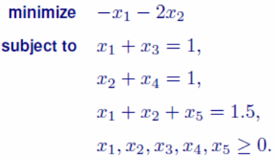

Mathematical Programming Code implemented in C++ when I am 
in third year of undergraduate.

## Input data format
a txt file containing the following:
```
-1 -2 0 0 0 0
1 0 1 0 0 1
0 1 0 1 0 1
1 1 0 0 1 1.5
```
Omitting the upper right element 0,
the first line gives the vector $c$. The last column gives $b$.
The remaining block is the matrix $A$.
If $A$ has shape $m\times n$, we require that the input block has shape
$(m+1) \times (n+1)$.
Therefore, the above input file describes a LP problem in the following sense:

